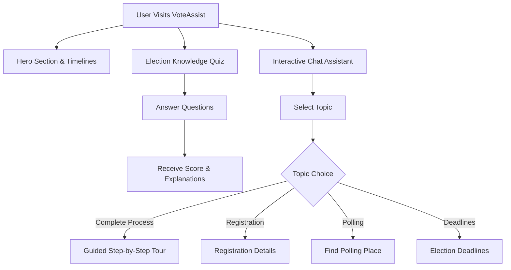
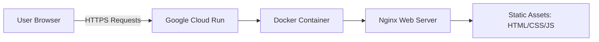

# VoteAssist 🗳️

VoteAssist is an interactive, web-based intelligent assistant designed to help users navigate the United States election process. It demystifies the voting process by providing a clear, step-by-step interactive conversational flow, an educational quiz, and visual timelines for important deadlines.

## 🌟 Key Features
- **Interactive Conversational AI**: A guided chat tour that breaks down the election process into simple, actionable steps (Registration, Education, Methods, and Casting).
- **Knowledge Quiz**: An interactive, scored quiz to test users' knowledge about voting rights, deadlines, and methods.
- **Dynamic Timelines**: Visual representations of important pre-election and election-day timelines.
- **Premium UI/UX**: Built with a sleek, modern glassmorphism design, vibrant gradients, and smooth micro-animations.

## 🏗️ Architecture & Workflow

### User Interaction Flow
The application provides a seamless transition between learning, interacting, and testing knowledge:



### Deployment Architecture
The project is built entirely with Vanilla HTML, CSS, and JS, making it extremely fast and lightweight. It is containerized using Nginx and deployed on Google Cloud Run.



## 🚀 Running Locally
1. Clone the repository:
   ```bash
   git clone https://github.com/Yash2007-sengar/voteassist.git
   ```
2. Navigate to the project directory:
   ```bash
   cd voteassist
   ```
3. Use any static server (like `serve` via npm) or open `index.html` directly in your browser:
   ```bash
   npx serve .
   ```

## ☁️ Deployment (Google Cloud Run)
The repository includes a `Dockerfile` pre-configured to serve the static assets using Alpine Nginx on port 8080 (Cloud Run's default). 

To deploy using Google Cloud CLI:
```bash
gcloud auth login
gcloud config set project [YOUR_PROJECT_ID]
gcloud run deploy voteassist --source . --region us-central1 --allow-unauthenticated
```
